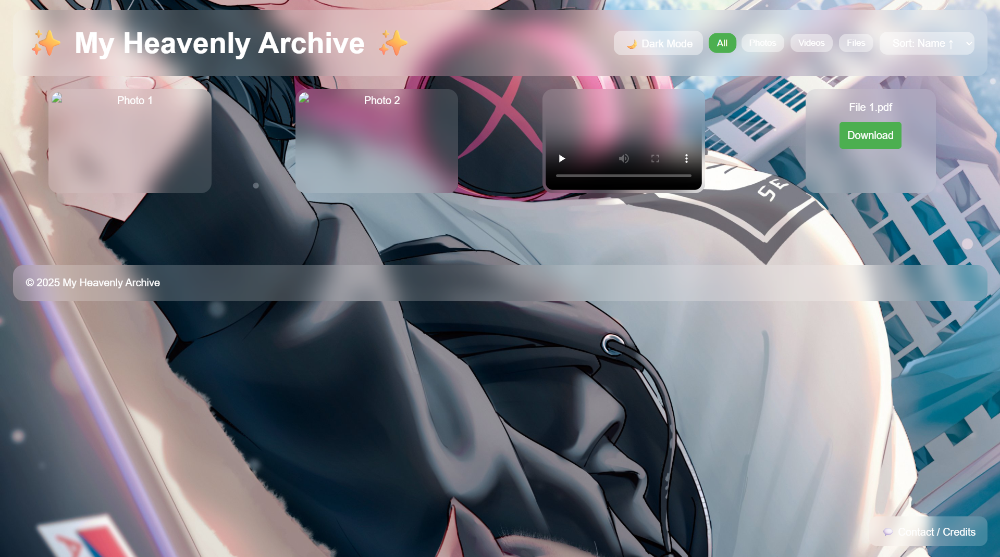
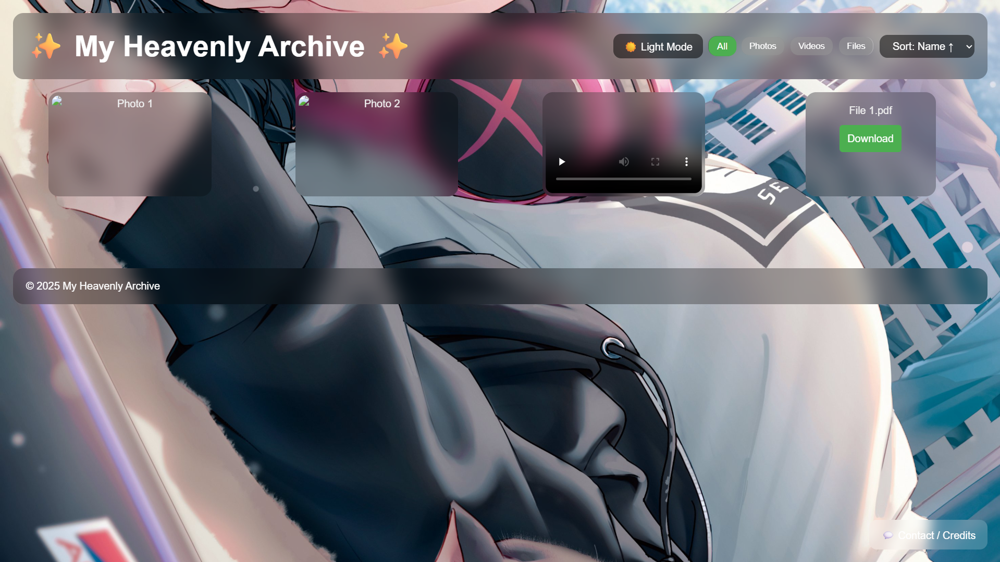

<!-- Banner -->


<p align="center">
  
</p>

<p align="center">
  
  
  
  
  
</p>

---

## 📸 Preview

<p align="center">
  <table>
    <tr>
      <td align="center">
        <br>
        <b>Gallery View</b>
      </td>
      <td align="center">
        <br>
        <b>Filters</b>
      </td>
    </tr>
  </table>
</p>

A sleek **glassmorphism-based archive** to organize photos, videos, and files.  
Includes **filters, sorting, lightbox, and dynamic GitHub backgrounds** ✨.

---

## ✅ Features at a Glance

<div align="center">

### 🖼️ Media Gallery  
Display **Photos, Videos, and Files** in a modern grid  

---

### 🎨 Glassmorphism UI  
Blurred glass panels with smooth hover animations  

---

### 🌙 Theme Toggle  
Switch easily between **Light & Dark** modes  

---

### 🔍 Filters  
Filter content by **All, Photos, Videos, or Files**  

---

### ↕️ Sorting  
Sort media by **Name ↑, Name ↓, or Type**  

---

### 💡 Lightbox  
Fullscreen view for photos & videos with one click  

---

### 🖼️ Dynamic Backgrounds  
Choose background images from **GitHub repo** or fallback image  

---

### 📱 Responsive & Smooth  
Fully responsive design with fade-in animations  

---

### ⚡ Extras  
- Floating **Credits modal** with contact links  
- Persistent **background selection (localStorage)**  

</div>

---

## 💡 Tips & Tricks

- 🔍 Use the **filter buttons** to show only Photos, Videos, or Files  
- ↕️ Sort gallery items with the **dropdown menu**  
- 🖼️ Click any media to open it in the **lightbox**  
- 🎨 Change the **background** dynamically from GitHub or local fallback  
- 🌙 Toggle between **Dark/Light** modes anytime  

---

## 🛠️ Tech Stack  

<p align="center">
  
</p>

---

## 📊 GitHub Stats (Project)

<p align="center">
  
</p>

---

## ASCII Banner

<!--ascii-start-->
Font: `block`
Message: `My Heavenly Archive ✨`
```text
   _____            ___ ___                                   .__         
  /     \ ___.__.  /   |   \   ____ _____ ___  __ ____   ____ |  | ___.__.
 /  \ /  <   |  | /    ~    \_/ __ \\__  \\  \/ // __ \ /    \|  |<   |  |
/    Y    \___  | \    Y    /\  ___/ / __ \\   /\  ___/|   |  \  |_\___  |
\____|__  / ____|  \___|_  /  \___  >____  /\_/  \___  >___|  /____/ ____|
        \/\/             \/       \/     \/          \/     \/     \/     
   _____                .__    .__                                        
  /  _  \_______   ____ |  |__ |__|__  __ ____                            
 /  /_\  \_  __ \_/ ___\|  |  \|  \  \/ // __ \                           
/    |    \  | \/\  \___|   Y  \  |\   /\  ___/                           
\____|__  /__|    \___  >___|  /__| \_/  \___  >                          
        \/            \/     \/              \/
```
<!--ascii-end-->

---

## 🌐 Connect with me

<p align="center">
  <a href="https://github.com/Bismay-exe" target="_blank">
    
  </a>

  <a href="https://instagram.com/bismay.exe" target="_blank">
    
  </a>

  <a href="https://t.me/bismay_exe" target="_blank">
    
  </a>

  <a href="https://discord.com" target="_blank">
    
  </a>
</p>

<p align="center">
  <a href="https://youtube.com" target="_blank">
    
  </a>

  <a href="https://linkedin.com" target="_blank">
    
  </a>

  <a href="https://threads.net/@bismay.exe" target="_blank">
    
  </a>

  <a href="https://t.me/BismaysInventory" target="_blank">
    
  </a>
</p>


---
